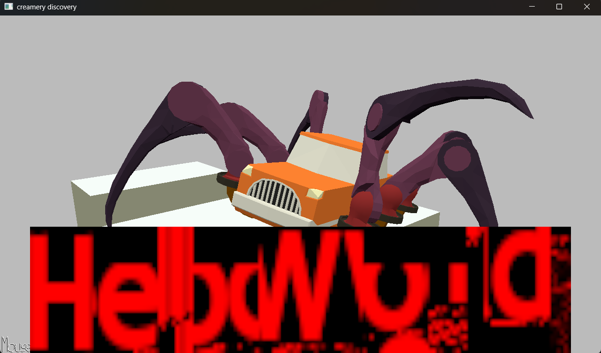

# Creamery Discovery

Author: Kenechukwu Echezona

Design: The game would have had you select a type of cone/bowl, one of three ice cream flavors, and one of three toppings.

Text Drawing: I spent all week trying to wrap my head around harfbuzz, freetype, and opengl, and just trying to get text to display, but I can't even get it to run for long consistently crashing, and there's so much noise :(

Choices: I thought about having each state as a node, with different choices being a handle other nodes, and having a "current node" to display text. I would have used a text file to hold all the choices, parsing things like "description", "choices," and the number of each other state node that a choice can take you to.

Screen Shot:

How To Play:

(TODO: describe the controls and (if needed) goals/strategy.)

Sources:
- Font used: [Google Font Hammersmith One](https://fonts.google.com/specimen/Hammersmith+One?preview.text=Select%20a%20cone%20type!&query=nic)

This game was built with [NEST](NEST.md).

